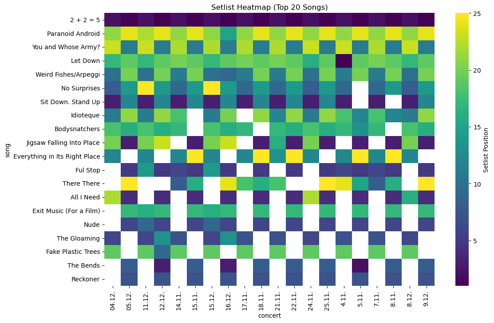

# Radiohead 2025 Tour Setlist Analysis

Exploratory Data Analysis of Radiohead’s 2025 tour setlists, focusing on
song frequency, setlist structure, album representation, and concert similarity.

## Project Overview

This project analyzes a manually maintained dataset tracking Radiohead’s
live setlists across multiple European cities during their 2025 tour.

The main objectives were to:
- Clean and restructure a messy real-world dataset
- Explore which songs appear most consistently
- Analyze setlist structure through song order
- Compare concerts based on setlist similarity

The project emphasizes exploratory data analysis (EDA) rather than prediction
or machine learning.

## Motivation & Attribution

This project was created as a personal, passion-driven analysis combining
an interest in music with data exploration and visualization.

The dataset is based on a publicly shared spreadsheet tracking Radiohead’s
2025 tour setlists, originally compiled and maintained by Reddit user
**u/danielcloutier** on the Radiohead subreddit.

The data was used solely for non-commercial, educational, and portfolio
purposes.

## Dataset

- Source: Manually tracked concert setlists
- Format: CSV
- Key features:
  - Song title
  - Album
  - Total play count
  - Song position within each concert setlist

## Methods

- Data cleaning and header reconstruction
- Wide-to-long data reshaping using `pandas.melt`
- Aggregation and grouping
- Data visualization with Matplotlib and Seaborn
- Correlation-based similarity analysis between concerts

## Key Findings

- A small core of songs appears consistently across almost all concerts
- Setlist structure is highly stable across cities
- Album representation favors older, iconic releases
- Concert-to-concert variation exists but is limited

## Tools

- Python
- Pandas
- NumPy
- Matplotlib
- Seaborn
- Jupyter Notebook

## Example Visualizations

### Setlist Heatmap
The heatmap below shows the position of frequently played songs across concerts,
highlighting the stability of the tour setlist structure.



## How to Run

- Run The Radiohead.ipynb File using Jupyter Notebook
    
```bash
pip install pandas numpy matplotlib seaborn
jupyter notebook
